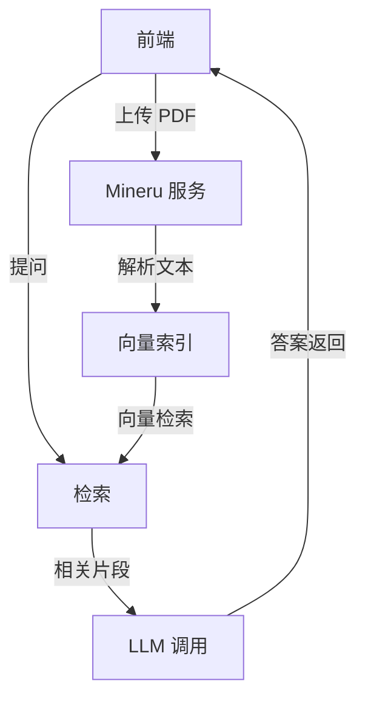

# 架构概览

本项目的数据流和模块关系如下图所示：

```mermaid
graph TD
    FE[前端] -->|上传 PDF| Mineru[Mineru 服务]
    Mineru -->|解析文本| Index[向量索引]
    FE -->|提问| Search[检索]
    Search -->|相关片段| LLM[LLM 调用]
    LLM -->|答案返回| FE
    Index -->|向量检索| Search
```

- **Mineru 服务**：负责解析上传的 PDF，生成可索引的文本。
- **向量索引**：存储文档的向量表示，支持高效检索。
- **检索**：根据用户问题在向量索引中寻找相关片段。
- **LLM 调用**：结合检索结果和问题，调用大型语言模型生成回答。
- **前端**：提供文件上传、提问和展示答案的界面。
